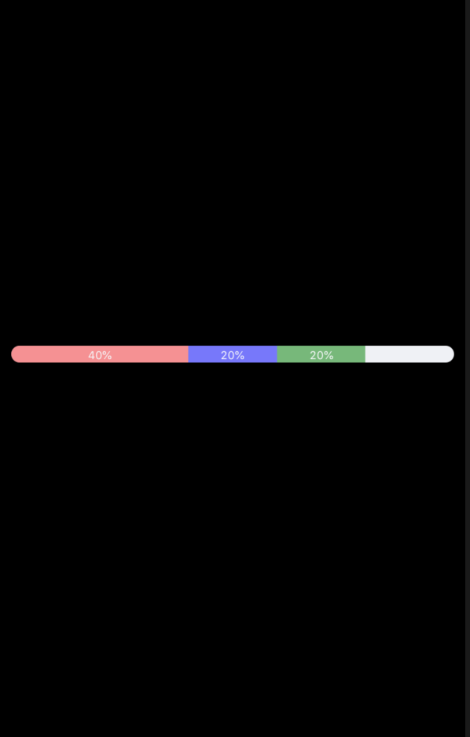

# react-native-multicolor-progress-bar

Progress indicators

example



## Installation

```
npm install react-native-multicolor-progress-bar --save
```

## Usage

import {ProgressBar} from 'react-native-multicolor-progress-bar';
```
<ProgressBar
  arrayOfProgressObjects={[
   {
     color: 'red',
     value: 0.4,
     nameToDisplay: "40%"
   },
   {
     color: 'blue',
     value: 0.6,
     opacity: 0.5
   },
  ]}
/>
```

## Properties for progress component

| Prop        | DataType | Description     | Default  |
| ------------- |:--------:|:----------------:| ---------- |
| parentViewStyle  | styles | Change the styling of the container view     |   `{alignItems:'stretch'}` |
| backgroundBarStyle | styles |  Change the styling of base progress bar    |    ```{alignItems:'stretch',backgroundColor: '#EFF1F5',borderRadius: 8.5,height: 12}``` |
| onStartProgressStyle | styles | Change the border radius of starting progress bar | `{borderTopLeftRadius: 8.5,borderBottomLeftRadius: 8.5}`|
| onEndProgressStyle | styles | Change the border radius of ending progress bar if it reaches the end of base progress bar | `{borderTopRightRadius: 8.5,borderBottomRightRadius: 8.5}`|
| arrayOfProgressObjects | array of Objects | Contains the **progress objects**.| [] |
| onPress | function | if provided, this function will be called if the user taps on the progress bar | undefined |
| textStyle | styles | styling of the text displayed in each coloured progress bar | `{fontSize:10}` |

### Progress Object
| Key        | DataType | Value |
| ---------- |:--------:|:--------:|
| color | string |color of the progress object |
| opacity | number | opacity of the progress object |
| nameToDisplay | string | if exists, displays this on the progress |
| value | number ranging from 0 - 1 | value of the progress |

#### Example project bundled with this module
